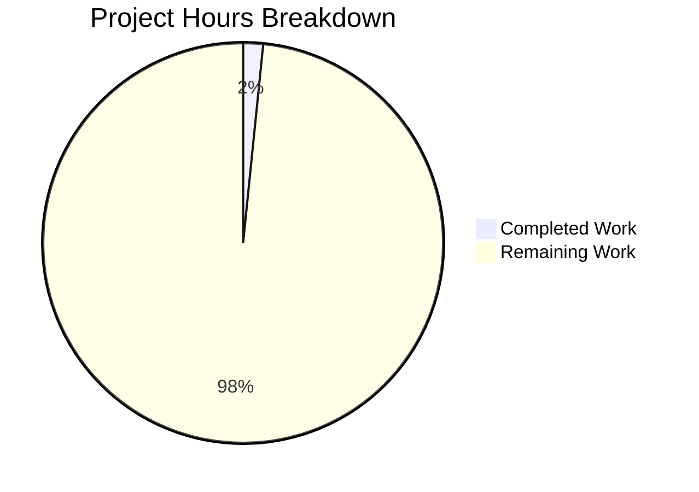

# Project Guide: Node.js to Flask Migration

## Executive Summary

**Project Status: BLOCKED - Awaiting Source Code**

This project aims to migrate a Node.js server application to Python 3 using Flask 3.1.2 while preserving all functionalities. However, **no Node.js source code exists in the repository** to perform the migration.

**Completion Assessment:**
- **2.5 hours completed** out of an estimated **155.5 total hours** = **2% complete**
- Completed work: Environment setup and dependency configuration
- Remaining work: Entire migration (blocked pending source code)

The development environment is fully prepared and validated with Flask 3.1.2 and all required dependencies. The project awaits human intervention to provide the Node.js source code before migration work can begin.

---

## 1. Validation Results Summary

### 1.1 What Was Accomplished

| Category | Status | Details |
|----------|--------|---------|
| Repository Setup | ✅ Complete | Branch created, base configuration established |
| Dependencies | ✅ Installed | 30+ Python packages installed via pip |
| Virtual Environment | ✅ Configured | Python 3.12.3 venv with all dependencies |
| Git Configuration | ✅ Complete | .gitignore for Python projects |
| Test Framework | ✅ Operational | pytest runs successfully (0 tests - expected) |
| Flask Imports | ✅ Verified | All Flask extensions import correctly |

### 1.2 Git Commit Analysis

| Metric | Value |
|--------|-------|
| Total Commits | 1 |
| Files Created | 2 (.gitignore, requirements.txt) |
| Lines Added | 97 |
| Lines Removed | 0 |
| Branch | blitzy-a262e663-f6c7-475a-b643-eb95b0e3a84b |

### 1.3 Dependency Validation Results

All dependencies from `requirements.txt` were installed and verified:

```
✅ Flask==3.1.2
✅ Werkzeug>=3.1 (installed: 3.1.5)
✅ pymongo>=4.6.0 (installed: 4.16.0)
✅ redis>=5.0.0 (installed: 7.1.0)
✅ pytest>=8.0.0 (installed: 9.0.2)
✅ gunicorn>=21.0.0 (installed: 23.0.0)
✅ Flask-CORS, Flask-JWT-Extended, Flask-PyMongo, Flask-Caching
✅ black, flake8, mypy (development tools)
```

### 1.4 Blocking Issue

**CRITICAL BLOCKER**: The Agent Action Plan (Section 0.1.1) identified that no Node.js source code exists in the repository:

> "The Blitzy platform has conducted an exhaustive repository search and discovered that **no Node.js source code exists in the current repository**."

The repository contains only:
- `README.md`: Placeholder with "# 13nov04"
- `requirements.txt`: Flask dependencies (added by setup agent)
- `.gitignore`: Python project configuration (added by setup agent)

---

## 2. Hours Breakdown and Completion Analysis

### 2.1 Completed Work (2.5 hours)

| Task | Hours | Description |
|------|-------|-------------|
| Dependency Research | 1.0 | Identifying Flask 3.1.2 compatible packages |
| requirements.txt Creation | 0.5 | Writing dependency manifest |
| .gitignore Configuration | 0.5 | Python project ignore patterns |
| Environment Validation | 0.5 | Virtual environment setup and testing |
| **Total Completed** | **2.5** | |

### 2.2 Remaining Work (153 hours estimated)

Based on Agent Action Plan Section 0.5 for a typical Node.js to Flask migration:

| Task Category | Base Hours | With Multipliers |
|---------------|------------|------------------|
| Flask Application Factory | 6 | 9 |
| Route Handlers Migration | 20 | 29 |
| Middleware Conversion | 10 | 14 |
| Business Logic Services | 20 | 29 |
| Data Models | 12 | 17 |
| Utilities Migration | 6 | 9 |
| Configuration Setup | 3 | 4 |
| Test Migration | 20 | 29 |
| Docker/Deployment | 6 | 9 |
| Documentation | 3 | 4 |
| **Total Remaining** | **106** | **153** |

*Note: Multipliers applied: Compliance (1.15x) × Uncertainty (1.25x) = 1.44x*

### 2.3 Completion Percentage Calculation

```
Completed Hours: 2.5
Remaining Hours: 153
Total Project Hours: 2.5 + 153 = 155.5
Completion: 2.5 / 155.5 = 1.6% ≈ 2%
```

### 2.4 Visual Representation



---

## 3. Development Guide

### 3.1 System Prerequisites

| Requirement | Version | Notes |
|-------------|---------|-------|
| Python | 3.9+ (recommended: 3.12) | Flask 3.1.2 requirement |
| pip | 25.0+ | Package manager |
| Git | 2.0+ | Version control |
| MongoDB | 8.2 (per Tech Spec) | For data persistence |
| Redis | 7.0+ (per Tech Spec) | For caching |

### 3.2 Environment Setup

```bash
# Clone the repository
git clone <repository-url>
cd <repository-name>

# Checkout the development branch
git checkout blitzy-a262e663-f6c7-475a-b643-eb95b0e3a84b

# Create and activate virtual environment
python3 -m venv venv
source venv/bin/activate  # Linux/Mac
# venv\Scripts\activate   # Windows
```

### 3.3 Dependency Installation

```bash
# Install all dependencies
pip install -r requirements.txt

# Verify installation
pip list | grep -E "Flask|pytest|gunicorn"
```

**Expected Output:**
```
Flask              3.1.2
Flask-Caching      2.3.1
flask-cors         6.0.2
Flask-JWT-Extended 4.7.1
Flask-PyMongo      3.0.1
gunicorn           23.0.0
pytest             9.0.2
pytest-cov         7.0.0
pytest-flask       1.3.0
```

### 3.4 Verification Steps

```bash
# Verify Flask imports work
python3 -c "
from flask import Flask, jsonify, request
from flask_cors import CORS
from flask_jwt_extended import JWTManager
print('All Flask dependencies verified!')
"

# Run pytest (should show 0 tests collected)
pytest -v
```

**Expected Output:**
```
All Flask dependencies verified!
============================= test session starts ==============================
collected 0 items
============================ no tests ran in 0.01s =============================
```

### 3.5 Application Startup (When Code Is Added)

Once Flask application code is created:

```bash
# Development server
export FLASK_APP=app
export FLASK_ENV=development
flask run --reload

# Production server
gunicorn -w 4 -b 0.0.0.0:5000 "app:create_app()"
```

### 3.6 Environment Variables Template

Create `.env` file (when application is implemented):

```bash
# Flask Configuration
FLASK_APP=app
FLASK_ENV=development
SECRET_KEY=your-secret-key-here

# Database (MongoDB)
MONGODB_URI=mongodb://localhost:27017/your_database

# Redis Cache
REDIS_URL=redis://localhost:6379/0

# JWT Settings
JWT_SECRET_KEY=your-jwt-secret-key
```

---

## 4. Human Tasks

### 4.1 Detailed Task Table

| # | Task | Description | Priority | Severity | Hours | Confidence |
|---|------|-------------|----------|----------|-------|------------|
| 1 | **Provide Node.js Source Code** | Upload or commit the original Node.js server codebase including all .js/.ts files, package.json, and configuration | HIGH | CRITICAL | 1 | High |
| 2 | **Alternative: Provide API Specification** | If source code unavailable, provide OpenAPI/Swagger spec or endpoint documentation | HIGH | CRITICAL | 2 | High |
| 3 | **Create Flask Application Factory** | Implement `create_app()` pattern in `app/__init__.py` with extension initialization | HIGH | HIGH | 9 | Medium |
| 4 | **Migrate Route Handlers** | Convert Express routes to Flask Blueprints preserving all endpoints | HIGH | HIGH | 29 | Medium |
| 5 | **Convert Middleware** | Implement Flask `before_request`/`after_request` hooks for cross-cutting concerns | MEDIUM | HIGH | 14 | Medium |
| 6 | **Migrate Business Logic** | Translate JavaScript service classes to Python modules | MEDIUM | HIGH | 29 | Low |
| 7 | **Convert Data Models** | Translate Mongoose/Sequelize schemas to SQLAlchemy/Pydantic models | MEDIUM | HIGH | 17 | Medium |
| 8 | **Migrate Utilities** | Convert JavaScript helper functions to Python equivalents | MEDIUM | MEDIUM | 9 | Medium |
| 9 | **Setup Configuration** | Implement Flask config classes with environment handling | LOW | MEDIUM | 4 | High |
| 10 | **Migrate Tests** | Convert Jest/Mocha tests to pytest test suite | MEDIUM | MEDIUM | 29 | Low |
| 11 | **Update Docker Configuration** | Configure Dockerfile and docker-compose for Python runtime | LOW | LOW | 9 | Medium |
| 12 | **Write Documentation** | Update README and create API documentation | LOW | LOW | 4 | High |

**Total Remaining Hours: 153 hours** (matches pie chart)

### 4.2 Task Priority Legend

| Priority | Meaning |
|----------|---------|
| HIGH | Must be completed before any migration work can proceed |
| MEDIUM | Required for production but not immediately blocking |
| LOW | Nice-to-have or can be done in parallel |

### 4.3 Task Severity Legend

| Severity | Impact |
|----------|--------|
| CRITICAL | Project cannot proceed without resolution |
| HIGH | Core functionality affected |
| MEDIUM | Secondary functionality affected |
| LOW | Quality/optimization concern |

---

## 5. Risk Assessment

### 5.1 Technical Risks

| Risk | Severity | Likelihood | Mitigation |
|------|----------|------------|------------|
| No Node.js source code available | **CRITICAL** | **CURRENT** | User must provide source code or API specification |
| Unknown Node.js complexity | HIGH | Likely | Request code analysis before committing to estimates |
| Async pattern translation | MEDIUM | Possible | Use Python asyncio; test thoroughly |
| Dependency compatibility | LOW | Unlikely | All target dependencies validated and working |

### 5.2 Security Risks

| Risk | Severity | Likelihood | Mitigation |
|------|----------|------------|------------|
| Unknown auth mechanisms in source | HIGH | Unknown | Document auth requirements when source is provided |
| Secret management | MEDIUM | Possible | Use environment variables; add .env to .gitignore (done) |
| Input validation gaps | MEDIUM | Possible | Implement marshmallow schemas for all inputs |

### 5.3 Operational Risks

| Risk | Severity | Likelihood | Mitigation |
|------|----------|------------|------------|
| Missing monitoring/logging | MEDIUM | Likely | Add Flask-Logging and health check endpoints |
| No deployment configuration | LOW | Current | Add Dockerfile and docker-compose when app exists |
| Database connectivity | LOW | Possible | Test MongoDB connection early in migration |

### 5.4 Integration Risks

| Risk | Severity | Likelihood | Mitigation |
|------|----------|------------|------------|
| Unknown external API dependencies | HIGH | Unknown | Document all integrations when source is analyzed |
| API contract changes | MEDIUM | Possible | Maintain exact endpoint signatures from Node.js |
| MongoDB schema compatibility | LOW | Unlikely | Use same document structure as original |

---

## 6. Recommendations

### 6.1 Immediate Actions Required

1. **CRITICAL**: Obtain the Node.js source code or detailed API specification
2. **HIGH**: Once source is available, conduct thorough code analysis to refine estimates
3. **MEDIUM**: Set up CI/CD pipeline for the new Python application

### 6.2 Migration Strategy (When Unblocked)

1. Start with Flask application factory pattern
2. Migrate routes incrementally, testing each endpoint
3. Convert middleware to Flask request hooks
4. Translate business logic preserving all algorithms
5. Migrate tests alongside code changes
6. End-to-end integration testing
7. Performance comparison with original Node.js server

### 6.3 Questions for Stakeholders

1. Where is the Node.js source code located?
2. Are there existing API consumers that depend on exact response formats?
3. Is the `/app` directory (containing "archie-job-reverse-document-generator") related to this migration?
4. What does "13nov04" reference in the README?
5. Are there specific performance requirements for the Flask application?

---

## 7. Appendix

### 7.1 Files Created by Agents

| File | Lines | Purpose |
|------|-------|---------|
| `.gitignore` | 58 | Python project ignore patterns |
| `requirements.txt` | 39 | Flask 3.1.2 dependencies |

### 7.2 Repository Structure

```
/
├── README.md           # Placeholder (original, unchanged)
├── requirements.txt    # Flask dependencies (new)
├── .gitignore          # Python ignore patterns (new)
├── venv/               # Virtual environment (local only)
└── .pytest_cache/      # Test cache (local only)
```

### 7.3 Validated Dependency List

```
Flask==3.1.2
Werkzeug>=3.1
Jinja2>=3.1.2
ItsDangerous>=2.2
click>=8.1.3
blinker>=1.9
python-dotenv>=1.0.0
gunicorn>=21.0.0
pymongo>=4.6.0
Flask-PyMongo>=2.3.0
redis>=5.0.0
Flask-Caching>=2.1.0
marshmallow>=3.20.0
Flask-CORS>=4.0.0
Flask-JWT-Extended>=4.6.0
PyJWT>=2.8.0
pytest>=8.0.0
pytest-cov>=4.1.0
pytest-flask>=1.3.0
black>=24.0.0
flake8>=7.0.0
mypy>=1.8.0
```

---

## 8. Conclusion

The Flask 3.1.2 development environment is **fully prepared and validated**. All dependencies are installed and working correctly. The project is **blocked at 2% completion** awaiting Node.js source code to proceed with the migration.

**Next Step**: Human intervention required to provide the Node.js server code or API specification before any further development work can be performed.