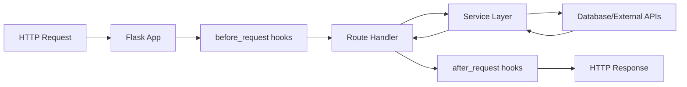

# Technical Specification

# 0. Agent Action Plan

## 0.1 Intent Clarification

### 0.1.1 Core Objective

Based on the provided requirements, the Blitzy platform understands that the objective is to:

- **Rewrite an existing Node.js server application to Python 3 using the Flask framework**
- **Preserve all functionalities** of the original Node.js server in the new Python Flask implementation
- **Migrate the entire codebase** from JavaScript/Node.js paradigms to Python conventions and Flask patterns

**CRITICAL GAP IDENTIFIED:** The Blitzy platform has conducted an exhaustive repository search and discovered that **no Node.js source code exists in the current repository**. The indexed repository contains:

| Location | Content Found | Node.js Code Present |
|----------|--------------|----------------------|
| Repository Root | `README.md` (contains only "# 13nov04") | ❌ No |
| `/app` directory | Python project (archie-job-reverse-document-generator) | ❌ No |
| All searched paths | No `package.json`, `.js`, `.ts` files | ❌ No |

**Implicit Requirements Detected:**

- The user expects a Node.js codebase to exist that will serve as the source for migration
- The target architecture aligns with Flask 3.1.2 (as documented in the tech spec)
- Complete functional parity is required between source and target implementations

**Prerequisites Required:**

1. **Node.js Source Code Access:** The original Node.js server code must be provided or made accessible
2. **Functionality Documentation:** If source code is unavailable, detailed API specifications and feature documentation are needed
3. **Test Cases/Examples:** Any existing tests or usage examples that define expected behavior

### 0.1.2 Task Categorization

| Attribute | Classification |
|-----------|----------------|
| **Primary Task Type** | Refactoring (Language/Framework Migration) |
| **Secondary Aspects** | Architecture translation, API preservation, Test migration |
| **Scope Classification** | Cross-cutting change (affects entire codebase) |
| **Migration Direction** | Node.js/Express → Python 3/Flask |
| **Current Status** | ⚠️ Blocked - Source code not available |

### 0.1.3 Special Instructions and Constraints

**User Directive Analysis:**

- "Can you rewrite" → Indicates complete rewrite, not incremental modification
- "this node.js server" → References a specific existing server (not found in repository)
- "in python 3 using flask" → Explicit technology choice for target implementation
- "preserving all functionalities" → Strict requirement for functional parity

**Methodological Requirements:**

- Maintain 1:1 feature mapping between source and target
- Follow Flask best practices and Python conventions
- Ensure API compatibility for existing consumers
- Preserve all business logic and data handling patterns

### 0.1.4 Technical Interpretation

These requirements translate to the following technical implementation strategy:

**Once the Node.js source code is provided:**

| Objective | Technical Action | Target Component |
|-----------|-----------------|------------------|
| Convert HTTP server | Replace Express.js with Flask | `app.py` (new) |
| Migrate route handlers | Transform Express routes to Flask decorators | `routes/*.py` (new) |
| Convert middleware | Implement Flask middleware patterns | `middleware/*.py` (new) |
| Translate models | Convert to Python classes/SQLAlchemy | `models/*.py` (new) |
| Migrate configuration | Convert to Python config patterns | `config.py` (new) |
| Translate async logic | Convert callbacks/promises to Python async | Throughout codebase |
| Convert tests | Translate Jest/Mocha to pytest | `tests/*.py` (new) |

**Typical Node.js to Flask Pattern Translations:**

| Node.js/Express Pattern | Flask Equivalent |
|------------------------|------------------|
| `app.get('/path', handler)` | `@app.route('/path', methods=['GET'])` |
| `req.params` | `request.args` or `request.view_args` |
| `req.body` | `request.json` or `request.form` |
| `res.json(data)` | `jsonify(data)` |
| `res.status(404).send()` | `return jsonify(error), 404` |
| `middleware(req, res, next)` | `@app.before_request` decorator |
| `async/await` | Python `async/await` with async Flask |
| `require('module')` | `import module` |
| `module.exports` | Python module exports |


## 0.2 Repository Scope Discovery

### 0.2.1 Comprehensive File Analysis

The Blitzy platform conducted an exhaustive repository search to identify all affected files. The following discoveries were made:

**Indexed Repository Contents:**

| Path | Type | Content | Relevance |
|------|------|---------|-----------|
| `README.md` | File | Contains only "# 13nov04" | Placeholder only |

**Search for Node.js/JavaScript Files:**

```
Search Patterns Executed:
- **/*.js (JavaScript files)
- **/*.ts (TypeScript files)  
- **/package.json (npm manifest)
- **/node_modules/** (dependencies)
- **/*.mjs, **/*.cjs (ES modules)
```

| Search Pattern | Results Found | Relevant Matches |
|---------------|---------------|------------------|
| `*.js` files | 0 | None |
| `*.ts` files | 0 | None |
| `package.json` | 1 (in npm cache, unrelated) | None |
| Express/Node.js config | 0 | None |

**External `/app` Directory Discovery:**

An external `/app` directory exists outside the indexed repository containing:

| File/Folder | Description |
|-------------|-------------|
| `/app/main.py` | Python entry point using `langgraph`, `google-cloud` |
| `/app/requirements.txt` | Python dependencies including `blitzy-platform-shared` |
| `/app/lib/reverse_document/` | Python module with `doc.py`, `helper.py`, `models.py`, `prompts.py`, `state.py` |
| `/app/Dockerfile` | Docker configuration |
| `/app/Makefile` | Build automation |

**⚠️ Critical Finding:** The `/app` directory contains an **existing Python project** (not Node.js), named "archie-job-reverse-document-generator". This is **NOT** the Node.js server referenced in the user's request.

### 0.2.2 Web Search Research Conducted

| Research Topic | Key Findings |
|----------------|--------------|
| Node.js to Flask Migration | Migrating routes requires adjusting syntax while keeping logic similar; use Flask decorators to replace Express route handlers |
| Flask 3.1 Best Practices | Flask 3.1.2 released August 2025; requires Werkzeug >= 3.1, Python 3.9+; supports Python 3.12 |
| Flask Project Structure | Recommended modular structure with `app/`, `routes/`, `models/`, `templates/`, `static/`, `tests/` directories |
| Express vs Flask Patterns | Express uses callback-based middleware; Flask uses decorators; both support similar routing concepts |
| Flask Migration Strategies | Create equivalent endpoints matching existing Node.js routes; translate middleware to Flask patterns |

### 0.2.3 Existing Infrastructure Assessment

**Current Project Structure (Indexed Repository):**

```
/
├── README.md          # Placeholder file only
└── (empty)            # No source code present
```

**Tech Spec Target Architecture:**

According to the Technical Specification documents retrieved:

| Component | Target Technology | Version |
|-----------|------------------|---------|
| Backend Language | Python | 3.14.x |
| Web Framework | Flask | 3.1.2 |
| Template Engine | Jinja2 | (bundled with Flask) |
| WSGI Server | Werkzeug | >= 3.1 |
| Database | MongoDB | 8.2 |
| Cache | Redis | (specified) |

**Existing Patterns and Conventions:**

The Tech Spec defines a Flask REST API architecture with:
- Route handlers using Flask decorators
- Request/response parsing via Werkzeug
- Blueprint-based modular organization
- Factory pattern for app initialization

**Documentation System:**

- Markdown documentation expected
- API documentation following REST conventions
- Code comments following Python docstring standards

### 0.2.4 Gap Analysis Summary

| Expected Item | Status | Impact |
|---------------|--------|--------|
| Node.js source code (`*.js`, `*.ts`) | ❌ Not Found | **BLOCKER** - Cannot proceed without source |
| `package.json` manifest | ❌ Not Found | Cannot identify dependencies to migrate |
| Express route definitions | ❌ Not Found | Cannot map routes to Flask |
| Node.js tests | ❌ Not Found | Cannot migrate test coverage |
| API documentation | ❌ Not Found | Cannot verify functional parity |
| Environment configuration | ❌ Not Found | Cannot replicate environment |

**Required User Action:**

To proceed with this migration, the user must provide one of the following:

1. **Option A:** The complete Node.js codebase (all `.js`/`.ts` files, `package.json`, etc.)
2. **Option B:** Detailed API specifications (endpoints, request/response formats, business logic)
3. **Option C:** Clarification if the existing Python code in `/app` should be refactored instead


## 0.3 File Transformation Mapping

### 0.3.1 File-by-File Execution Plan

**⚠️ IMPORTANT:** The following file transformation mapping is a **framework** based on typical Node.js/Express to Flask migrations. Actual file mappings will be determined once the Node.js source code is provided.

**Transformation Mode Legend:**
- **CREATE** - Create a new file
- **UPDATE** - Update an existing file  
- **DELETE** - Remove an obsolete file
- **REFERENCE** - Use as an example to reflect existing patterns

**Target Flask Project Structure:**

| Target File | Transformation | Source File/Reference | Purpose/Changes |
|-------------|----------------|----------------------|-----------------|
| `app/__init__.py` | CREATE | Node.js `app.js` or `server.js` | Flask application factory with app initialization |
| `app/routes/__init__.py` | CREATE | Express route definitions | Blueprint registration and route module initialization |
| `app/routes/api.py` | CREATE | Node.js route handlers | Primary API endpoints converted to Flask decorators |
| `app/models/__init__.py` | CREATE | Node.js models directory | Python model definitions using SQLAlchemy or Pydantic |
| `app/middleware/__init__.py` | CREATE | Express middleware | Flask before_request/after_request handlers |
| `app/services/__init__.py` | CREATE | Node.js service layer | Business logic service classes |
| `app/utils/__init__.py` | CREATE | Node.js utility functions | Helper functions and utilities |
| `app/config.py` | CREATE | Node.js config files | Flask configuration with environment handling |
| `requirements.txt` | CREATE | `package.json` | Python dependencies equivalent to npm packages |
| `Dockerfile` | CREATE | Existing `Dockerfile` (if any) | Updated for Python/Flask runtime |
| `docker-compose.yml` | CREATE | Existing compose file (if any) | Multi-service orchestration |
| `tests/__init__.py` | CREATE | Node.js test files | pytest test suite initialization |
| `tests/test_routes.py` | CREATE | Jest/Mocha route tests | API endpoint tests using pytest |
| `tests/conftest.py` | CREATE | Test configuration | pytest fixtures and configuration |
| `run.py` | CREATE | Node.js entry point | Flask application entry point |
| `.env.example` | CREATE | `.env` or config | Environment variable template |
| `.flaskenv` | CREATE | N/A | Flask-specific environment configuration |
| `README.md` | UPDATE | `README.md` | Documentation for the Flask application |

### 0.3.2 New Files Detail

**Application Core Files:**

- `app/__init__.py` - Flask application factory
  - Content type: source/configuration
  - Based on: Flask application factory pattern
  - Key functions: `create_app()`, extension initialization, blueprint registration

- `app/routes/api.py` - API route handlers
  - Content type: source code
  - Based on: Express route files
  - Key sections: Route decorators, request handling, response formatting

- `app/models/__init__.py` - Data models
  - Content type: source code
  - Based on: Node.js Mongoose/Sequelize models
  - Key sections: SQLAlchemy/Pydantic model classes, relationships, validations

**Configuration Files:**

- `app/config.py` - Application configuration
  - Content type: configuration
  - Based on: Node.js `config.js` or environment files
  - Key sections: Development/Production/Testing configs, database URIs, secrets

- `requirements.txt` - Python dependencies
  - Content type: configuration
  - Based on: `package.json` dependencies
  - Key sections: Flask, extensions, database drivers, utilities

**Test Files:**

- `tests/test_routes.py` - Route tests
  - Content type: test
  - Based on: Node.js route tests
  - Key sections: API endpoint tests, authentication tests, validation tests

- `tests/conftest.py` - Test configuration
  - Content type: test/configuration
  - Based on: Test setup patterns
  - Key sections: Flask test client fixture, database fixtures, mock configurations

### 0.3.3 Configuration and Documentation Updates

**Configuration Changes:**

| Config File | Specific Settings | Impact |
|-------------|------------------|--------|
| `app/config.py` | `SQLALCHEMY_DATABASE_URI`, `SECRET_KEY`, `DEBUG` | Core Flask configuration |
| `.flaskenv` | `FLASK_APP=run.py`, `FLASK_ENV=development` | Flask CLI configuration |
| `.env.example` | Database credentials, API keys, secrets | Environment template |
| `Dockerfile` | Python base image, pip install, gunicorn | Containerization |

**Documentation Updates:**

| Doc File | Sections to Update | Cross-references |
|----------|-------------------|------------------|
| `README.md` | Installation, Setup, Running, API endpoints | Link to API docs |
| `docs/API.md` | CREATE - Full API documentation | Route specifications |
| `docs/MIGRATION.md` | CREATE - Migration notes | Changes from Node.js |

### 0.3.4 Cross-File Dependencies

**Import/Reference Updates Required:**

Once source files are created, ensure:
- All route blueprints are registered in `app/__init__.py`
- Model imports are consistent across routes and services
- Configuration is loaded before app initialization
- Test fixtures properly initialize the application

**Configuration Sync Requirements:**

| Source Config | Target Config | Sync Required |
|--------------|--------------|---------------|
| `package.json` scripts | `Makefile` / `pyproject.toml` | Build commands |
| Node.js env variables | Flask env variables | Environment parity |
| npm dependencies | pip dependencies | Equivalent packages |

### 0.3.5 Typical Node.js to Flask File Mappings

When Node.js source is provided, the following typical mappings will apply:

| Node.js File Pattern | Flask Equivalent | Notes |
|---------------------|------------------|-------|
| `app.js` / `server.js` | `app/__init__.py` + `run.py` | Application entry and factory |
| `routes/*.js` | `app/routes/*.py` | Blueprint-based routes |
| `models/*.js` | `app/models/*.py` | SQLAlchemy/Pydantic models |
| `middleware/*.js` | `app/middleware/*.py` | Request hooks and decorators |
| `controllers/*.js` | `app/services/*.py` | Business logic services |
| `utils/*.js` | `app/utils/*.py` | Helper utilities |
| `config/*.js` | `app/config.py` | Configuration module |
| `tests/*.test.js` | `tests/test_*.py` | pytest test files |
| `package.json` | `requirements.txt` | Dependencies |
| `Dockerfile` | `Dockerfile` | Updated for Python |


## 0.4 Dependency Inventory

### 0.4.1 Key Private and Public Packages

**Target Flask Framework Dependencies:**

Based on the Tech Spec requirements and Flask 3.1.2 best practices, the following packages will be required:

| Registry | Package Name | Version | Purpose |
|----------|--------------|---------|---------|
| PyPI | Flask | 3.1.2 | Web application framework |
| PyPI | Werkzeug | >= 3.1 | WSGI toolkit (Flask dependency) |
| PyPI | Jinja2 | >= 3.1.2 | Template engine (Flask dependency) |
| PyPI | ItsDangerous | >= 2.2 | Secure data signing (Flask dependency) |
| PyPI | Click | >= 8.1.3 | CLI toolkit (Flask dependency) |
| PyPI | Blinker | >= 1.9 | Signal support (Flask dependency) |
| PyPI | python-dotenv | >= 1.0.0 | Environment variable management |
| PyPI | gunicorn | >= 21.0.0 | Production WSGI server |

**Common Flask Extensions (to be determined based on Node.js source):**

| Registry | Package Name | Version | Purpose |
|----------|--------------|---------|---------|
| PyPI | Flask-SQLAlchemy | >= 3.1.0 | Database ORM integration |
| PyPI | Flask-Migrate | >= 4.0.0 | Database migrations via Alembic |
| PyPI | Flask-CORS | >= 4.0.0 | Cross-Origin Resource Sharing |
| PyPI | Flask-JWT-Extended | >= 4.6.0 | JWT authentication |
| PyPI | Flask-RESTful | >= 0.3.10 | REST API utilities |
| PyPI | marshmallow | >= 3.20.0 | Object serialization/validation |
| PyPI | pymongo | >= 4.6.0 | MongoDB driver (per Tech Spec) |
| PyPI | redis | >= 5.0.0 | Redis client (per Tech Spec) |

**Testing Dependencies:**

| Registry | Package Name | Version | Purpose |
|----------|--------------|---------|---------|
| PyPI | pytest | >= 8.0.0 | Testing framework |
| PyPI | pytest-cov | >= 4.1.0 | Test coverage reporting |
| PyPI | pytest-flask | >= 1.3.0 | Flask testing utilities |
| PyPI | pytest-asyncio | >= 0.23.0 | Async test support |
| PyPI | httpx | >= 0.26.0 | HTTP client for testing |

**Development Dependencies:**

| Registry | Package Name | Version | Purpose |
|----------|--------------|---------|---------|
| PyPI | black | >= 24.0.0 | Code formatting |
| PyPI | flake8 | >= 7.0.0 | Linting |
| PyPI | mypy | >= 1.8.0 | Type checking |
| PyPI | pre-commit | >= 3.6.0 | Git hooks |

### 0.4.2 Node.js to Python Package Equivalents

When the Node.js source code is provided, the following package translations will be applied:

| Node.js Package (npm) | Python Equivalent (PyPI) | Notes |
|----------------------|--------------------------|-------|
| express | Flask | Web framework |
| mongoose | Flask-PyMongo or pymongo | MongoDB ODM/driver |
| sequelize | Flask-SQLAlchemy | SQL ORM |
| jsonwebtoken | PyJWT or Flask-JWT-Extended | JWT handling |
| bcrypt | bcrypt | Password hashing |
| cors | Flask-CORS | CORS middleware |
| dotenv | python-dotenv | Environment variables |
| axios | requests or httpx | HTTP client |
| lodash | Standard library / more-itertools | Utilities |
| moment | datetime / pendulum | Date handling |
| joi / yup | marshmallow / pydantic | Validation |
| winston / morgan | logging / structlog | Logging |
| jest / mocha | pytest | Testing |
| supertest | pytest-flask + httpx | API testing |
| nodemon | flask run --reload | Auto-reload |
| pm2 | gunicorn + supervisor | Process management |
| socket.io | Flask-SocketIO | WebSockets |
| multer | Flask uploads | File uploads |
| passport | Flask-Login | Authentication |
| helmet | Flask-Talisman | Security headers |
| compression | Flask-Compress | Response compression |
| rate-limiter-flexible | Flask-Limiter | Rate limiting |

### 0.4.3 Dependency Updates (Pending Source Code)

**New Dependencies to Add:**

Once Node.js source is analyzed, the following will be documented:
- Package name: [version] - [reason for addition]
- Specific packages based on Node.js dependencies found

**Import/Reference Updates:**

Once source code is available, import transformations will follow this pattern:

| Node.js Import | Python Import |
|---------------|---------------|
| `const express = require('express')` | `from flask import Flask` |
| `const router = express.Router()` | `from flask import Blueprint` |
| `const mongoose = require('mongoose')` | `from flask_pymongo import PyMongo` |
| `const jwt = require('jsonwebtoken')` | `from flask_jwt_extended import JWTManager` |

### 0.4.4 Requirements.txt Template

Based on Tech Spec and Flask 3.1.2 best practices, the initial `requirements.txt` will include:

```text
# Core Framework

Flask==3.1.2
Werkzeug>=3.1
Jinja2>=3.1.2
ItsDangerous>=2.2
click>=8.1.3
blinker>=1.9

#### Environment & Configuration

python-dotenv>=1.0.0

#### Production Server

gunicorn>=21.0.0

#### Database (per Tech Spec - MongoDB 8.2)

pymongo>=4.6.0
Flask-PyMongo>=2.3.0

#### Caching (per Tech Spec - Redis)

redis>=5.0.0
Flask-Caching>=2.1.0

#### API & Serialization

marshmallow>=3.20.0
Flask-CORS>=4.0.0

#### Authentication (if required)

Flask-JWT-Extended>=4.6.0
PyJWT>=2.8.0

#### Testing

pytest>=8.0.0
pytest-cov>=4.1.0
pytest-flask>=1.3.0

#### Development

black>=24.0.0
flake8>=7.0.0
mypy>=1.8.0
```

**Note:** This template will be adjusted based on actual Node.js `package.json` dependencies once provided.


## 0.5 Implementation Design

### 0.5.1 Technical Approach

**Primary Objectives with Implementation Approach:**

| Objective | Implementation Approach | Target Components |
|-----------|------------------------|-------------------|
| Migrate HTTP server | Replace Express.js with Flask application factory pattern | `app/__init__.py`, `run.py` |
| Convert route handlers | Transform Express routes to Flask Blueprint decorators | `app/routes/*.py` |
| Translate middleware | Implement Flask `before_request`/`after_request` hooks | `app/middleware/*.py` |
| Migrate business logic | Convert JavaScript classes/functions to Python modules | `app/services/*.py` |
| Transform data models | Convert to Python dataclasses, Pydantic, or SQLAlchemy | `app/models/*.py` |
| Convert async patterns | Transform callbacks/Promises to Python async/await | Throughout codebase |
| Migrate tests | Convert Jest/Mocha to pytest with pytest-flask | `tests/*.py` |
| Update deployment | Configure for Python runtime with gunicorn | `Dockerfile`, configs |

**Logical Implementation Flow:**

1. **First**, establish the Flask application structure by creating the application factory in `app/__init__.py` with proper extension initialization and configuration loading

2. **Next**, migrate route definitions by converting Express router modules to Flask Blueprints, preserving endpoint paths and HTTP methods

3. **Then**, translate middleware by implementing Flask request hooks (`before_request`, `after_request`) and decorators for cross-cutting concerns

4. **Subsequently**, convert business logic by translating JavaScript service classes to Python modules, adapting async patterns appropriately

5. **Following that**, migrate data models by converting Mongoose/Sequelize schemas to SQLAlchemy models or Pydantic schemas

6. **Afterward**, translate utility functions by converting JavaScript helpers to Python equivalents using standard library and Flask extensions

7. **Finally**, migrate tests by converting Jest/Mocha test suites to pytest, ensuring functional parity validation

### 0.5.2 Component Impact Analysis

**Direct Modifications Required:**

| Component | Modification | Purpose |
|-----------|-------------|---------|
| Application Entry | Create Flask app factory replacing `server.js` | Initialize Flask with proper configuration |
| Routes Module | Convert all Express routes to Flask Blueprints | Preserve API endpoint structure |
| Middleware Layer | Transform Express middleware to Flask patterns | Maintain request/response processing |
| Service Layer | Translate business logic to Python classes | Preserve application behavior |
| Model Layer | Convert data schemas to Python models | Maintain data structure integrity |
| Configuration | Translate environment handling to Flask config | Preserve configuration flexibility |

**Indirect Impacts and Dependencies:**

| Component | Impact | Reason |
|-----------|--------|--------|
| CI/CD Pipeline | Must be updated | New Python build/test commands required |
| Docker Configuration | Must be updated | Python base image and dependencies |
| Documentation | Must be updated | Installation and usage instructions change |
| Environment Variables | Must be mapped | Different naming conventions possible |
| Database Connections | Must be verified | Driver differences between Node.js and Python |

**New Components Introduction:**

| Component | Type | Responsibility | Rationale |
|-----------|------|----------------|-----------|
| Flask Application Factory | Module | App initialization and configuration | Flask best practice for scalable apps |
| Blueprint Modules | Modules | Modular route organization | Flask pattern for route organization |
| Request Hooks | Decorators | Cross-cutting concerns | Flask equivalent to Express middleware |
| Config Classes | Classes | Environment-based configuration | Flask configuration pattern |

### 0.5.3 Flask Application Architecture

**Recommended Flask Project Structure:**

```
project/
├── app/
│   ├── __init__.py          # Application factory
│   ├── config.py            # Configuration classes
│   ├── routes/
│   │   ├── __init__.py      # Blueprint registration
│   │   ├── api.py           # Main API routes
│   │   ├── auth.py          # Authentication routes
│   │   └── health.py        # Health check endpoints
│   ├── models/
│   │   ├── __init__.py      # Model exports
│   │   └── schemas.py       # Pydantic/Marshmallow schemas
│   ├── services/
│   │   ├── __init__.py      # Service exports
│   │   └── business.py      # Business logic
│   ├── middleware/
│   │   ├── __init__.py      # Middleware registration
│   │   ├── auth.py          # Authentication middleware
│   │   └── logging.py       # Request logging
│   └── utils/
│       ├── __init__.py      # Utility exports
│       └── helpers.py       # Helper functions
├── tests/
│   ├── __init__.py
│   ├── conftest.py          # pytest fixtures
│   ├── test_routes.py       # Route tests
│   └── test_services.py     # Service tests
├── run.py                   # Application entry point
├── requirements.txt         # Python dependencies
├── Dockerfile               # Container configuration
├── docker-compose.yml       # Multi-service setup
├── .env.example             # Environment template
├── .flaskenv                # Flask CLI configuration
└── README.md                # Documentation
```

### 0.5.4 Critical Implementation Details

**Design Patterns to Employ:**

| Pattern | Usage | Implementation |
|---------|-------|----------------|
| Application Factory | App initialization | `create_app()` function in `app/__init__.py` |
| Blueprint | Route organization | Modular route registration |
| Repository | Data access | Service classes abstracting database operations |
| Dependency Injection | Configuration | Flask extensions initialized in factory |
| Decorator | Cross-cutting concerns | Route decorators, authentication wrappers |

**Key Algorithms/Approaches:**

| Concern | Node.js Approach | Flask Approach |
|---------|-----------------|----------------|
| Async I/O | Event loop with callbacks/Promises | Python asyncio with async/await |
| Request Parsing | `body-parser` middleware | Flask `request.json`, `request.form` |
| Response Formatting | `res.json()`, `res.send()` | `jsonify()`, `make_response()` |
| Error Handling | Express error middleware | Flask `@app.errorhandler()` |
| Authentication | Passport.js strategies | Flask-Login or Flask-JWT-Extended |

**Data Flow Modifications:**



**Error Handling Strategy:**

| Error Type | Flask Implementation |
|------------|---------------------|
| 400 Bad Request | Custom validator with `abort(400)` |
| 401 Unauthorized | Auth middleware raising `Unauthorized` |
| 404 Not Found | `@app.errorhandler(404)` decorator |
| 500 Server Error | Global error handler with logging |
| Custom Errors | Exception classes with error handlers |

**Performance Considerations:**

- Use gunicorn with multiple workers for production
- Implement connection pooling for database connections
- Add caching with Flask-Caching and Redis
- Use async views where I/O-bound operations dominate

**Security Considerations:**

- Configure Flask-Talisman for security headers
- Use Flask-CORS with appropriate origin restrictions
- Implement rate limiting with Flask-Limiter
- Sanitize all user inputs
- Use secure session configuration


## 0.6 Scope Boundaries

### 0.6.1 Exhaustively In Scope

**Source Code Changes (to be created):**

| Category | File Patterns | Description |
|----------|--------------|-------------|
| Application Core | `app/__init__.py` | Flask application factory |
| Application Core | `app/config.py` | Configuration classes |
| Routes | `app/routes/*.py` | All API endpoint definitions |
| Models | `app/models/*.py` | Data models and schemas |
| Services | `app/services/*.py` | Business logic services |
| Middleware | `app/middleware/*.py` | Request/response processing |
| Utilities | `app/utils/*.py` | Helper functions |
| Entry Point | `run.py` | Application entry point |

**Configuration Updates:**

| Category | File Patterns | Description |
|----------|--------------|-------------|
| Dependencies | `requirements.txt` | Python package dependencies |
| Dependencies | `requirements-dev.txt` | Development dependencies |
| Environment | `.env.example` | Environment variable template |
| Environment | `.flaskenv` | Flask CLI configuration |
| Build | `Dockerfile` | Container configuration for Python |
| Build | `docker-compose.yml` | Multi-service orchestration |
| Build | `Makefile` | Build automation commands |
| Build | `pyproject.toml` | Python project metadata |

**Documentation Updates:**

| Category | File Patterns | Description |
|----------|--------------|-------------|
| Project | `README.md` | Updated installation and usage |
| API | `docs/API.md` | API endpoint documentation |
| Migration | `docs/MIGRATION.md` | Migration notes from Node.js |
| Contributing | `CONTRIBUTING.md` | Updated contribution guidelines |

**Test Files:**

| Category | File Patterns | Description |
|----------|--------------|-------------|
| Configuration | `tests/__init__.py` | Test package initialization |
| Configuration | `tests/conftest.py` | pytest fixtures and configuration |
| Unit Tests | `tests/unit/*.py` | Unit tests for services/utils |
| Integration | `tests/integration/*.py` | API integration tests |
| Route Tests | `tests/test_routes.py` | Endpoint tests |

**CI/CD Updates:**

| Category | File Patterns | Description |
|----------|--------------|-------------|
| Workflows | `.github/workflows/*.yml` | GitHub Actions for Python |
| Pipeline | `.gitlab-ci.yml` | GitLab CI for Python (if applicable) |

### 0.6.2 Explicitly Out of Scope

**Items NOT included in this migration:**

| Category | Item | Reason |
|----------|------|--------|
| Frontend | React/Vue/Angular components | Backend migration only |
| Infrastructure | Cloud provider changes | Infrastructure unchanged |
| Database Schema | Schema modifications | Functional parity requirement |
| New Features | Feature additions beyond source | Preserve existing functionality |
| Performance Optimization | Advanced caching strategies | Beyond migration scope |
| Refactoring | Architectural improvements | 1:1 migration focus |
| External Integrations | New third-party services | Not in source specification |
| Monitoring | Advanced observability setup | Post-migration enhancement |

**Related Features Not Specified:**

- WebSocket implementation (unless present in source)
- GraphQL endpoint creation (unless present in source)
- Microservice decomposition
- API versioning changes
- Authentication provider changes

**Process Boundaries:**

| Boundary | In Scope | Out of Scope |
|----------|----------|--------------|
| Testing | Equivalent test coverage | New test categories |
| Documentation | Migration documentation | Comprehensive API redesign |
| Deployment | Working deployment config | Production hardening |
| Security | Equivalent security measures | Security audit remediation |

### 0.6.3 Conditional Scope (Dependent on Source Code)

The following items will be scoped once Node.js source code is provided:

| Item | Condition | Action if Present |
|------|-----------|-------------------|
| WebSocket routes | If `socket.io` present | Implement Flask-SocketIO |
| GraphQL endpoint | If `apollo-server` present | Implement Flask-GraphQL |
| File uploads | If `multer` present | Implement Flask file handling |
| Background jobs | If `bull`/`agenda` present | Implement Celery/RQ |
| Real-time features | If SSE/WebSocket present | Implement Flask equivalents |
| OAuth providers | If Passport.js OAuth present | Implement Flask-Dance |

### 0.6.4 Scope Verification Criteria

**Functional Parity Checklist (to be validated post-migration):**

| Criterion | Verification Method |
|-----------|-------------------|
| All endpoints accessible | API test suite passes |
| Request/response formats match | Schema validation |
| Authentication works | Auth test cases pass |
| Error responses consistent | Error handling tests |
| Database operations identical | Data integrity tests |
| Performance acceptable | Load testing within thresholds |

**Migration Completeness Criteria:**

- [ ] All Node.js routes have Flask equivalents
- [ ] All npm dependencies have pip equivalents
- [ ] All tests translated and passing
- [ ] Documentation updated
- [ ] Docker configuration working
- [ ] CI/CD pipeline updated


## 0.7 Execution Parameters

### 0.7.1 Special Execution Instructions

**Process-Specific Requirements:**

| Requirement | Description | Implementation |
|-------------|-------------|----------------|
| Complete Rewrite | Full migration from Node.js to Python | No incremental hybrid approach |
| Functional Parity | All existing features must work | Comprehensive test validation |
| Technology Mandate | Python 3 with Flask framework | No alternative frameworks |
| Preservation Requirement | All functionalities preserved | No feature removal or reduction |

**Tools and Platforms:**

| Category | Specified | Not Specified |
|----------|-----------|---------------|
| Language | Python 3 (target: 3.14.x per Tech Spec) | - |
| Framework | Flask 3.1.2 | Alternative Python frameworks |
| Database | MongoDB 8.2 (per Tech Spec) | Database migration |
| Cache | Redis (per Tech Spec) | Alternative cache systems |
| Testing | pytest (Python standard) | - |

**Quality Requirements:**

| Quality Aspect | Requirement | Verification |
|---------------|-------------|--------------|
| Code Style | PEP 8 compliance | flake8/black validation |
| Type Hints | Python type annotations | mypy type checking |
| Documentation | Docstrings for public APIs | Documentation coverage |
| Test Coverage | Match or exceed Node.js coverage | pytest-cov reporting |
| Security | Equivalent to source | Security scan tools |

**Code Review Considerations:**

- All Flask routes should follow RESTful conventions
- Proper error handling with meaningful error messages
- Consistent response formats matching Node.js API
- Secure handling of sensitive data

### 0.7.2 Constraints and Boundaries

**Technical Constraints:**

| Constraint | Details | Impact |
|------------|---------|--------|
| Python Version | 3.9+ minimum (Flask 3.1.2 requirement) | Environment setup |
| Flask Version | 3.1.2 (per Tech Spec) | Dependency pinning |
| API Compatibility | Must match Node.js API contracts | No breaking changes |
| Database Compatibility | Must work with existing data | Schema preservation |

**Process Constraints:**

| Constraint | What to Do | What NOT to Do |
|------------|-----------|----------------|
| Migration Focus | Convert existing functionality | Add new features |
| Architecture | Follow Flask patterns | Maintain Node.js patterns in Python |
| Dependencies | Use Python equivalents | Use JavaScript packages |
| Testing | Translate existing tests | Skip test migration |

**Output Constraints:**

| Output Type | Should Generate | Should NOT Generate |
|-------------|----------------|---------------------|
| Source Code | Flask Python files | Mixed Node.js/Python |
| Configuration | Python-based config | JavaScript config files |
| Documentation | Python/Flask docs | Node.js documentation |
| Tests | pytest test suite | Jest/Mocha tests |

**Compatibility Requirements:**

| System | Requirement |
|--------|-------------|
| API Consumers | No breaking changes to API contracts |
| Database | Compatible with existing data |
| Environment | Works with existing infrastructure |
| Authentication | Same auth mechanisms |

### 0.7.3 Environment Configuration

**Development Environment:**

```bash
# Python version (per Flask 3.1.2 requirements)

Python >= 3.9 (recommended: 3.12)

#### Virtual environment setup

python -m venv venv
source venv/bin/activate  # Linux/Mac
venv\Scripts\activate     # Windows

#### Dependency installation

pip install -r requirements.txt

#### Development server

flask run --reload
```

**Production Environment:**

```bash
# WSGI Server

gunicorn -w 4 -b 0.0.0.0:5000 "app:create_app()"

#### Environment variables

export FLASK_ENV=production
export SECRET_KEY=<secure-key>
export DATABASE_URI=<mongodb-uri>
```

**Docker Environment:**

```dockerfile
FROM python:3.12-slim
WORKDIR /app
COPY requirements.txt .
RUN pip install -r requirements.txt
COPY . .
CMD ["gunicorn", "-w", "4", "-b", "0.0.0.0:5000", "app:create_app()"]
```

### 0.7.4 Execution Blockers

**Current Status: ⚠️ BLOCKED**

| Blocker | Severity | Resolution Required |
|---------|----------|---------------------|
| No Node.js source code in repository | **CRITICAL** | User must provide source code |
| Cannot identify endpoints to migrate | **CRITICAL** | API specification or source code needed |
| Cannot identify dependencies | **HIGH** | `package.json` required |
| Cannot verify functional parity | **HIGH** | Test cases or documentation needed |

**Required User Actions to Unblock:**

1. **Provide Node.js Source Code**
   - Upload or commit the Node.js server codebase
   - Include all JavaScript/TypeScript files
   - Include `package.json` and `package-lock.json`

2. **Alternative: Provide API Specification**
   - OpenAPI/Swagger specification
   - Endpoint documentation
   - Request/response examples

3. **Clarify if Misunderstanding Exists**
   - Confirm if the existing Python code in `/app` should be refactored
   - Clarify the relationship to "13nov04" reference in README


## 0.8 Rules

### 0.8.1 User-Specified Rules

Based on the user's request, the following rules are explicitly defined:

| Rule | Directive | Implementation |
|------|-----------|----------------|
| Technology Choice | Use Python 3 with Flask | All server code in Python 3, Flask 3.1.2 |
| Functional Preservation | Preserve all functionalities | 1:1 feature mapping required |
| Complete Migration | Rewrite the entire server | No partial or hybrid solution |

### 0.8.2 Inferred Rules from Requirements

| Rule | Basis | Enforcement |
|------|-------|-------------|
| API Contract Preservation | "preserving all functionalities" | Same endpoints, methods, request/response formats |
| Behavioral Equivalence | "preserving all functionalities" | Same business logic outcomes |
| Error Handling Parity | Implied by preservation | Same error codes and messages |
| Authentication Compatibility | Implied by preservation | Same auth mechanisms |

### 0.8.3 Technical Rules

**Framework Rules:**

| Rule | Description |
|------|-------------|
| Flask Application Factory | Use `create_app()` pattern for initialization |
| Blueprint Organization | Organize routes using Flask Blueprints |
| Configuration Management | Use Flask config classes with environment overrides |
| Extension Initialization | Initialize extensions in application factory |

**Code Quality Rules:**

| Rule | Standard |
|------|----------|
| Python Style | PEP 8 compliance required |
| Type Hints | Use type annotations for public APIs |
| Docstrings | Document all public functions and classes |
| Import Order | Follow isort/black conventions |

**Security Rules:**

| Rule | Implementation |
|------|----------------|
| No Hardcoded Secrets | Use environment variables for all secrets |
| Input Validation | Validate all user inputs |
| Secure Headers | Implement security headers via Flask-Talisman |
| CORS Configuration | Restrict origins appropriately |

**Testing Rules:**

| Rule | Description |
|------|-------------|
| Test Coverage | Maintain or exceed original coverage |
| Test Naming | Use descriptive test function names |
| Fixture Usage | Use pytest fixtures for test setup |
| Isolation | Tests must be independent and idempotent |

### 0.8.4 Migration-Specific Rules

**DO's:**

| Category | Rule |
|----------|------|
| Routes | Map every Node.js endpoint to a Flask route |
| Middleware | Convert Express middleware to Flask request hooks |
| Models | Translate data models to Python equivalents |
| Utilities | Convert helper functions to Python |
| Tests | Translate all test cases to pytest |
| Configuration | Migrate all config to Flask patterns |

**DON'Ts:**

| Category | Rule |
|----------|------|
| Features | Do not add features not in source |
| Architecture | Do not change API contracts |
| Dependencies | Do not add unnecessary packages |
| Database | Do not modify database schema |
| Breaking Changes | Do not introduce breaking changes |
| Skipping | Do not skip any functionality |

### 0.8.5 Code Convention Rules

**File Naming:**

| Type | Convention | Example |
|------|------------|---------|
| Modules | lowercase_with_underscores | `user_service.py` |
| Classes | PascalCase | `UserService` |
| Functions | lowercase_with_underscores | `get_user_by_id` |
| Constants | UPPERCASE_WITH_UNDERSCORES | `MAX_RETRIES` |
| Test Files | test_module_name.py | `test_user_service.py` |

**Import Rules:**

```python
# Standard library imports first

import os
import json
from datetime import datetime

#### Third-party imports second

from flask import Flask, request, jsonify
from flask_cors import CORS

#### Local imports last

from app.services import UserService
from app.models import User
```

**Response Format Rules:**

| Response Type | Format |
|--------------|--------|
| Success | `{"data": <result>}` or as per existing API |
| Error | `{"error": "<message>", "code": "<error_code>"}` or as per existing API |
| List | `{"data": [<items>], "count": <n>}` or as per existing API |
| Paginated | `{"data": [<items>], "page": <n>, "total": <n>}` or as per existing API |

**Note:** Actual response formats must match the existing Node.js API exactly to preserve functionality.

### 0.8.6 Constraint Rules

| Constraint | Rule |
|------------|------|
| Python Version | Must support Python 3.9+ |
| Flask Version | Pin to Flask 3.1.2 |
| Dependencies | Use stable, maintained packages only |
| Compatibility | Must work with existing infrastructure |
| Performance | Must meet existing performance benchmarks |


## 0.9 References

### 0.9.1 Repository Files Searched

**Indexed Repository Analysis:**

| File Path | Type | Content Summary | Relevance |
|-----------|------|-----------------|-----------|
| `README.md` | File | Contains only "# 13nov04" | Placeholder only; no project information |

**External `/app` Directory Analysis:**

| File Path | Type | Content Summary | Relevance |
|-----------|------|-----------------|-----------|
| `/app/README.md` | File | "# archie-job-reverse-document-generator" | Existing Python project, not Node.js source |
| `/app/main.py` | File | Python entry point with asyncio, langgraph, google-cloud imports | Different project, not migration source |
| `/app/requirements.txt` | File | Python deps: google-cloud-storage, blitzy-platform-shared | Existing Python dependencies |
| `/app/Dockerfile` | File | Docker configuration | Existing containerization |
| `/app/Makefile` | File | Build automation | Existing build config |
| `/app/lib/reverse_document/` | Folder | Python modules: doc.py, helper.py, models.py, prompts.py, state.py | Existing Python codebase |

**Search Patterns Executed:**

| Search Pattern | Purpose | Results |
|---------------|---------|---------|
| `*.js` | Find JavaScript files | None found |
| `*.ts` | Find TypeScript files | None found |
| `package.json` | Find npm manifest | 1 found (irrelevant npm cache) |
| `.blitzyignore` | Check for ignored patterns | None found |
| Node.js server files | Semantic search | No matches |
| Express route handlers | Semantic search | No matches |

### 0.9.2 Technical Specification Sections Retrieved

| Section | Key Information Retrieved |
|---------|--------------------------|
| 1.1 Executive Summary | Repository status: "does not yet contain application source code" |
| 1.2 System Overview | "No existing system documented", "Legacy system analysis: No existing system documented" |
| 2.2 Feature Catalog | "Status: No Features Cataloged" |
| 3.2 Programming Languages | Target: Python 3.14.x |
| 3.3 Frameworks & Libraries | Target: Flask 3.1.2, React 19.2.x |
| 5.2 Component Details | Flask REST API architecture, React Web Application |

### 0.9.3 External Research Sources

**Web Search Results Used:**

| Topic | Source | Key Finding |
|-------|--------|-------------|
| Node.js to Flask Migration | askhandle.com | "Migrating routes from Node.js to Flask requires adjusting the syntax while keeping the logic similar" |
| Flask vs Express Comparison | Medium (Jason Roell) | Flask integrates well with Python's scientific libraries; Express better for real-time functionality |
| Flask 3.1.2 Information | flask.palletsprojects.com | Dropped Python 3.8 support, requires Werkzeug >= 3.1 |
| Flask Package | PyPI | Flask 3.1.2 released August 2025, supports Python 3.9+ |
| Flask Best Practices 2025 | toxigon.com | Recommended modular project structure with app/, routes/, models/ |
| React + Flask Setup | miguelgrinberg.com | Python 3.12.7 recommended, Vite for React scaffolding |
| Flask Installation | flask.palletsprojects.com | "Flask supports Python 3.9 and newer" |

### 0.9.4 User-Provided Attachments

| Attachment | Status |
|------------|--------|
| User attachments | None provided |
| Figma URLs | None provided |
| Additional files | None in `/tmp/environments_files` |

### 0.9.5 Environment Variables

| Category | Status |
|----------|--------|
| User-provided environment variables | None provided |
| User-provided secrets | None provided |
| Setup instructions | None provided |

### 0.9.6 Technology Reference Matrix

**Flask 3.1.2 Core Dependencies:**

| Package | Minimum Version | Purpose |
|---------|----------------|---------|
| Werkzeug | >= 3.1 | WSGI toolkit |
| Jinja2 | >= 3.1.2 | Template engine |
| ItsDangerous | >= 2.2 | Data signing |
| Click | >= 8.1.3 | CLI toolkit |
| Blinker | >= 1.9 | Signal support |

**Python Version Compatibility:**

| Flask Version | Python Support |
|--------------|----------------|
| Flask 3.1.x | Python 3.9+ |
| Flask 3.0.x | Python 3.8+ |

### 0.9.7 Critical Findings Summary

| Finding | Impact | Action Required |
|---------|--------|-----------------|
| No Node.js source code in repository | **BLOCKER** | User must provide source code |
| Existing Python project in `/app` | Clarification needed | Confirm if this is relevant |
| Tech spec describes empty repository | Consistent with findings | N/A |
| Target tech stack is Flask | Aligned with request | Proceed when source available |

### 0.9.8 Recommended Next Steps

To proceed with this migration, the following actions are required:

1. **Immediate:** User provides the Node.js server source code
   - All `.js`/`.ts` files
   - `package.json` and `package-lock.json`
   - Any configuration files
   - Existing tests

2. **Alternative:** User provides API documentation
   - OpenAPI/Swagger specification
   - Endpoint inventory
   - Request/response examples

3. **Clarification:** User confirms scope
   - Is the `/app` Python project relevant?
   - What is "13nov04" reference in README?
   - Are there external repositories containing the source?

### 0.9.9 Reference Documentation Links

| Resource | URL |
|----------|-----|
| Flask Documentation | https://flask.palletsprojects.com/ |
| Flask Installation Guide | https://flask.palletsprojects.com/en/stable/installation/ |
| Flask on PyPI | https://pypi.org/project/Flask/ |
| pytest Documentation | https://docs.pytest.org/ |
| Python Style Guide (PEP 8) | https://peps.python.org/pep-0008/ |


